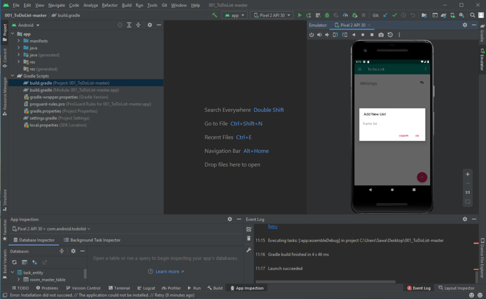
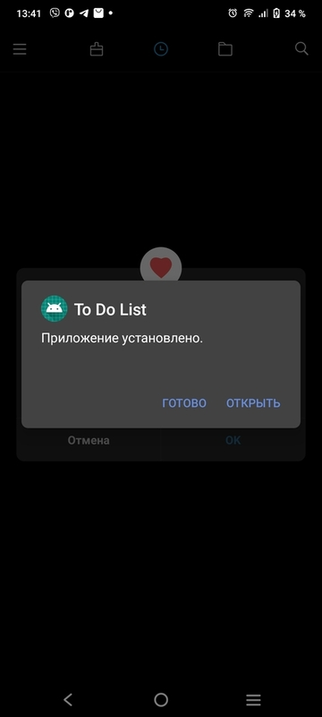

### В рамках курса было изучено:
___________________________________________
- Сборка и запуск приложения на эмуляторе 

- Установка приложения на реальное устройство   

- Удаление приложения на мобильном телефоне
- Просмотр логов

- Скриншот экрана мобильного телефона
- Запись экрана мобильного телефона
